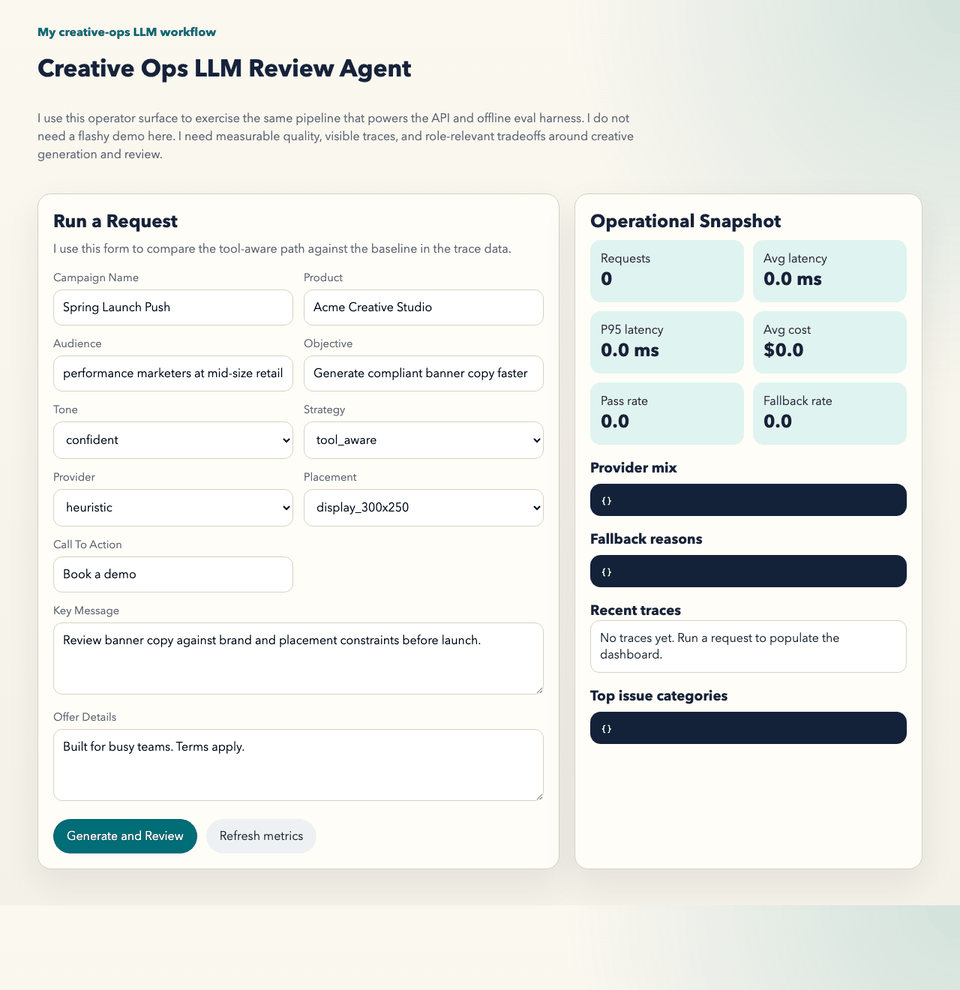

# Creative Ops Review Agent

I built this as a production-minded creative workflow project for real LLM system design and evaluation.

It takes a structured campaign brief, generates banner copy variants, reviews them against brand and placement constraints, and records the quality and ops signals I care about in a real LLM system:

- ingest a structured campaign brief
- generate multiple banner copy variants
- review them against brand, policy, and placement constraints
- expose trace, latency, cost, and failure signals
- run an offline eval comparing a baseline path to a tool-aware path

I kept the scope intentionally narrow. I was not trying to build a full ads platform. I was trying to show the engineering judgment behind a measurable LLM workflow:

- system boundaries
- dataset construction
- evaluation discipline
- observability
- latency and cost awareness
- production-minded APIs

## Quick Links

- [Case study](docs/case-study.md)
- [Architecture](docs/architecture.md)
- [Latest benchmark artifact](runs/evals/benchmark-20260403100247.json)

## At A Glance

- Shared `FastAPI` + eval pipeline with `heuristic`, `openai`, and `ollama` provider paths
- Golden dataset, failure taxonomy, traces, p95 latency, fallback rate, and provider mix
- Local `qwen3:4b` benchmark with deterministic fallback and preemptive routing

## Demo

This short GIF shows the operator flow I use locally: open the dashboard, run a request, inspect the generated variants, and see the trace-driven metrics update.



## Build Provenance


That means the repo was not handwritten from scratch in a vacuum. I used Codex to scaffold, iterate, debug, and tighten the implementation quickly, then I steered the scope, reviewed the outputs, chose the tradeoffs, and curated what stayed in the final project.

I want that to be explicit because the point of this repo is not to perform solo-authorship theater. The point is to show that I can use modern AI tooling honestly while still exercising engineering judgment.

## Why This Workflow

Instead of a generic chatbot, I focused on a creative review workflow where failures are visible and measurable.

That gave me room to build around the parts that matter most in an LLM system:

- structured inputs and constrained outputs
- dataset creation and evaluation
- observability and traceability
- tool boundaries for external truth
- quality, latency, and cost tradeoffs

## What The System Does

### Baseline path

- generates banner copy without consulting external constraints
- tends to overclaim, exceed placement limits, or miss required phrasing

### Tool-aware path

- loads brand rules
- loads placement and channel constraints
- loads policy rules
- generates tighter variants intended to survive review

### Review layer

Every variant is scored on:

- length compliance
- policy compliance
- brand alignment
- message clarity

Every issue is labeled into a failure taxonomy such as:

- `headline_length`
- `policy_claim`
- `brand_term`
- `required_term`
- `cta_alignment`

## Architecture

See [docs/architecture.md](docs/architecture.md) for the full flow.
See [docs/case-study.md](docs/case-study.md) for the case-study version.

High-level components:

1. `FastAPI` service for generation, review, traces, and metrics
2. provider abstraction with `heuristic`, `openai`, and `ollama` backends
3. shared tool runtime for brand, spec, and policy lookup
4. local MCP-style JSON-RPC tool server exposing the same lookup tools
5. shared pipeline for API and eval runs
6. offline eval harness using `data/golden_set.json`
7. JSON trace persistence plus OpenTelemetry span export
8. operator UI showing results, stage timings, recent traces, fallback rate, and provider mix

## Project Structure

```text
creative-ops-review-agent/
├── data/
├── docs/
├── runs/
├── src/creative_ops_review_agent/
│   ├── api.py
│   ├── eval_runner.py
│   ├── knowledge.py
│   ├── models.py
│   ├── observability.py
│   ├── pipeline.py
│   ├── scoring.py
│   ├── providers/
│   └── templates/
└── tests/
```

## Setup

```bash
cd creative-ops-review-agent
python3 -m venv .venv
source .venv/bin/activate
pip install -e ".[dev]"
```

## Run The API

```bash
creative-ops-api
```

Then open:

- [http://127.0.0.1:8000](http://127.0.0.1:8000)

Useful endpoints:

- `GET /healthz`
- `POST /api/generate`
- `POST /api/review`
- `GET /api/providers`
- `GET /api/traces`
- `GET /api/metrics/summary`

### Provider selection

By default, the API uses the provider named in `CREATIVE_OPS_PROVIDER`.

You can override it per request:

```bash
curl -X POST "http://127.0.0.1:8000/api/generate?strategy=tool_aware&provider=heuristic" \
  -H "Content-Type: application/json" \
  -d '{
    "brand_key": "acme",
    "campaign_name": "Spring Launch Push",
    "product_name": "Acme Creative Studio",
    "audience": "performance marketers at retail brands",
    "objective": "Generate compliant banner copy faster",
    "key_message": "Review banner copy against brand and placement constraints before launch.",
    "tone": "confident",
    "offer_details": "Built for busy teams. Terms apply.",
    "required_terms": ["Terms apply"],
    "forbidden_terms": ["guaranteed", "instant"],
    "call_to_action": "Book a demo",
    "channel": "display",
    "placement": "display_300x250"
  }'
```

Supported providers:

- `heuristic` - deterministic and credential-free
- `openai` - OpenAI Responses API with local function-calling tool execution
- `ollama` - native Ollama chat API path for local models such as Qwen

### OpenAI-backed path

If you want real model generation:

```bash
export OPENAI_API_KEY=...
export CREATIVE_OPS_PROVIDER=openai
export OPENAI_MODEL=gpt-5-mini
creative-ops-api
```

The OpenAI provider uses the Responses API and local function tools for:

- `get_brand_rules`
- `get_channel_spec`
- `get_policy_rules`

This keeps the tool-calling path real without requiring a public MCP endpoint during local development.

## Run The MCP Tool Server

```bash
creative-ops-mcp
```

Default endpoint:

- `http://127.0.0.1:8002/mcp`

The MCP server implements a lightweight JSON-RPC surface for:

- `initialize`
- `tools/list`
- `tools/call`

This is enough to demonstrate an MCP-style tool boundary around brand/spec/policy lookup.

If you want to connect a hosted model to this MCP server remotely, you will need to expose it through a public tunnel or deployment target. The local server is intentionally designed first for local inspection and protocol clarity.

## Run A Live Local Model Without OpenAI Credentials

If I have Ollama installed and a local model pulled, I can use the same pipeline with a local provider.

Example:

```bash
ollama pull qwen3:8b-q4_K_M
export CREATIVE_OPS_PROVIDER=ollama
export OLLAMA_MODEL=qwen3:8b-q4_K_M
export OLLAMA_THINK=false
export OLLAMA_LATENCY_BUDGET_MS=60000
export OLLAMA_FALLBACK_PROVIDER=heuristic
creative-ops-api
```

I kept the architecture, eval harness, and trace format the same while swapping only the model backend.

`OLLAMA_THINK=false` is deliberate for this project. Qwen3 models support a reasoning mode, but the creative-ops workflow is latency-sensitive and expects compact JSON output rather than long-form deliberation.

`OLLAMA_LATENCY_BUDGET_MS` enables a production-style guardrail for local inference. With preemptive routing enabled, the pipeline uses recent trace history to predict whether Ollama will miss the budget and can route directly to the fallback provider before invoking the local model. If the prediction is wrong or unavailable, the pipeline still retains the post-call fallback and provider-error fallback behavior.

## Run Offline Evals

```bash
creative-ops-eval --dataset data/golden_set.json
```

The report is printed to stdout and persisted under `runs/evals/`.

What matters to me in that benchmark is not the absolute score. It is the comparison:

- baseline vs tool-aware
- failure categories by strategy
- latency and cost deltas

To run the local benchmark matrix used in the case study:

```bash
creative-ops-benchmark --dataset data/golden_set.json --ollama-model qwen3:4b --fallback-budget-ms 1
```

The `1 ms` fallback budget is intentionally unrealistic. I use it to force the fallback scenario so I can measure rerouting behavior on the same dataset.

## Latest Local Benchmark

Report artifact:

- `runs/evals/benchmark-20260403100247.json`

Benchmark setup:

- dataset: `data/golden_set.json` with 3 cases
- local model: `qwen3:4b`
- fallback scenario: forced with `--fallback-budget-ms 1`

| Scenario | Avg score | Pass rate | Avg latency | P95 latency | Fallback rate | Final provider mix |
| --- | ---: | ---: | ---: | ---: | ---: | --- |
| `heuristic_tool_aware` | `0.987` | `1.0` | `1.03 ms` | `1.61 ms` | `0.0` | `heuristic-provider: 3` |
| `ollama_tool_aware_direct` | `0.990` | `1.0` | `122.4 s` | `135.6 s` | `0.0` | `ollama-chat: 3` |
| `ollama_tool_aware_fallback` | `0.987` | `1.0` | `4.3 ms` | `7.06 ms` | `1.0` | `heuristic-provider: 3` |

What matters in that benchmark:

- the local Ollama path slightly edges out the deterministic path on score, but only by `0.003`
- all three scenarios pass the full benchmark set after the repair step
- the preemptive router collapses the fallback slice from multi-minute local inference to single-digit milliseconds once it has recent Ollama history
- the first cold Ollama request still pays full local-model latency, so this is a history-based routing policy, not a universal shortcut

## Trace And Ops Artifacts

Generated artifacts land in:

- `runs/traces/` for per-request trace payloads
- `runs/app.jsonl` for structured logs
- `runs/spans.jsonl` for exported spans
- `runs/evals/` for offline evaluation reports

I wanted a reviewer to be able to inspect what happened without re-running the whole system.

For OpenAI-backed runs, traces also capture provider tool events and the raw model output text before parsing.

For Ollama-backed runs, traces also capture whether the request stayed on the local model or fell back after exceeding the latency budget or hitting a provider error.

For benchmark-backed screenshots and summaries, see [docs/case-study.md](docs/case-study.md).

## Interview Talking Points

I use this repo to answer questions like:

1. Why did you choose this workflow instead of a generic chatbot?
2. How did you make quality measurable?
3. Why is tool use justified here?
4. What did observability reveal that the demo alone would hide?
5. How did you keep scope honest when the local fallback still missed the latency goal?


## Limitations

- The default provider is deterministic and credential-free so the system is reproducible.
- I support a real OpenAI provider, but keep the deterministic path as the evaluation baseline.
- The local Ollama path uses a latency-budget fallback to keep the demo responsive on constrained hardware. For a real deployment, I would move the same policy behind a real inference service rather than a local process.
- The local MCP server is MCP-style and JSON-RPC based, but local execution still uses direct in-process tool calls for the OpenAI provider. I chose that to avoid forcing a public endpoint during development.
- The dataset is intentionally small. I care more about the evaluation loop than data scale theater.

Those limitations are useful interview material because they make the thin-slice boundary explicit.
