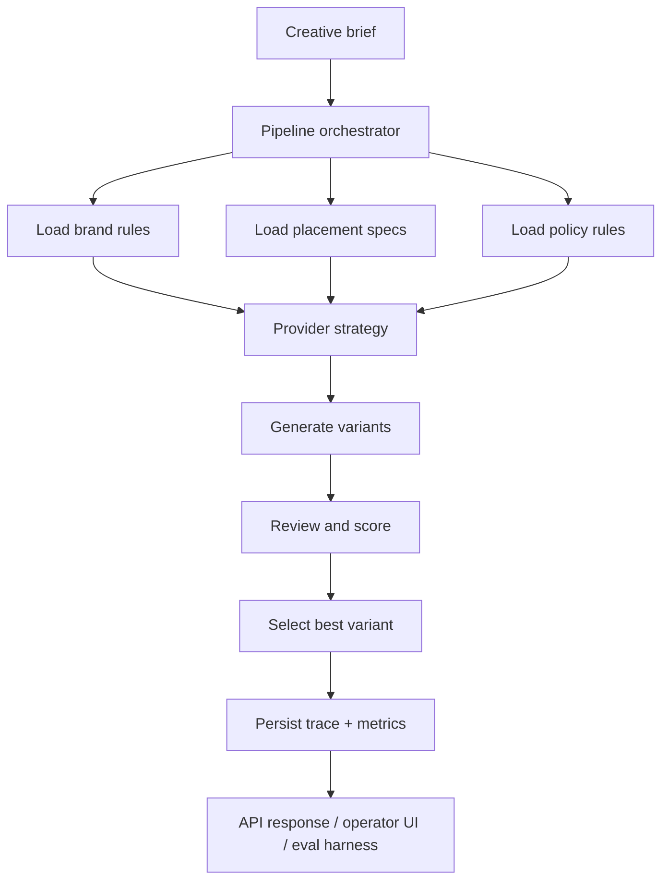

# Architecture

## System Goal

Show the creative review workflow I built in a way that is:

- measurable
- observable
- reproducible
- explainable in interview settings

## Request Flow

## Key Design Choices

### 1. Shared pipeline for demo and eval

I route the API and offline eval runner through the same pipeline code.

Why this matters:

- no separate "demo path" that behaves better than the system under test
- the traces you inspect in the UI are the same shape as the traces produced during evaluation
- improvements can be discussed with actual before/after artifacts

### 2. Deterministic provider by default

I keep the default provider heuristic and credential-free.

Why this matters:

- the project runs without secrets
- tests are stable
- evaluation is reproducible
- the signal I care about comes from architecture and measurement, not dependency on an external key

I am not pretending this outperforms frontier models. I am proving engineering habits.

### 3. Tool-aware generation as a strategy, not a buzzword

The tool-aware path consults:

- brand rules
- channel specs
- policy rules

Why this matters:

- it mirrors why tool calling or MCP exists in real systems: external truth and bounded actions
- it creates an evaluable comparison against a baseline that ignores those constraints

### 3a. One tool runtime, two protocol surfaces

I expose the same constraint lookup logic in two ways:

- direct in-process function tools for the OpenAI-backed provider
- a local MCP-style JSON-RPC server for protocol-level demonstration

Why this matters:

- the provider path stays fast and easy to run locally
- the project still shows a clean tool boundary that could be hosted behind a remote MCP endpoint later
- the business logic for constraint lookup exists in one place instead of splitting across demo code and protocol glue

### 4. Review layer as first-class functionality

I do not stop at generation.

It explicitly reviews outputs for:

- length
- policy claims
- brand term violations
- required terms
- CTA alignment
- message clarity

That turns "looks good to me" into a structured scoring conversation.

### 5. Operational artifacts are persisted locally

Every request can leave behind:

- structured trace JSON
- span export JSONL
- structured app logs
- eval reports

Why this matters:

- I can hand a reviewer concrete evidence instead of asking for trust
- I can replay failure analysis in an interview
- I can show how I debug regressions, not just how I produce output once

## What A Real Next Step Would Be

If I wanted to deepen the project after this thin slice:

1. swap in a real LLM adapter with prompt versioning
2. add human-judged rubric labels to the golden set
3. expose trace drill-down in the UI
4. add routing logic between a cheaper and more expensive model
5. wrap brand/spec/policy lookup as a small MCP-compatible tool layer

Those are natural extensions because the current structure already makes space for them.
