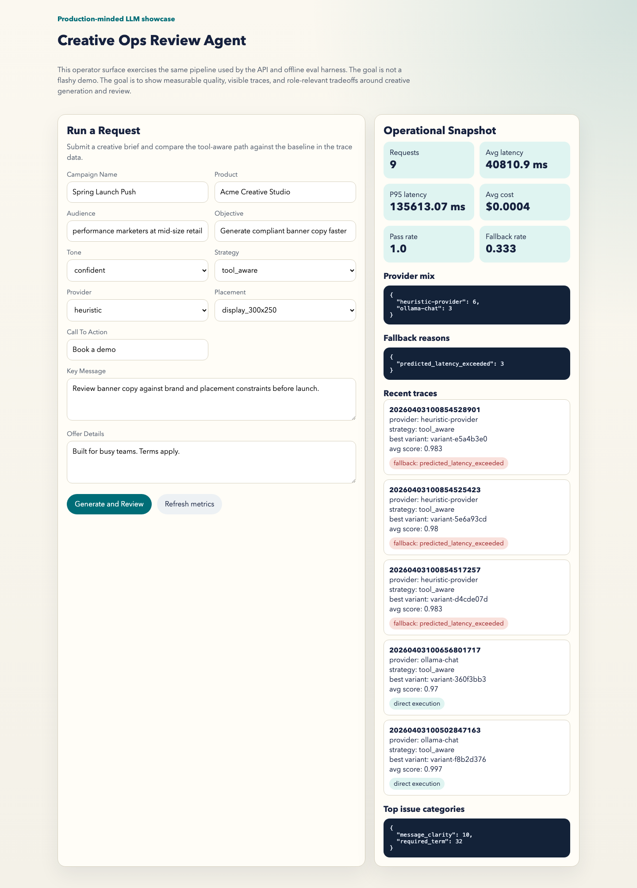

# Case Study

## Title

Creative Ops Review Agent: the evaluable, observable LLM workflow I built for banner copy generation and review.

## The Problem

Creative and account teams often move from campaign brief to banner copy through scattered docs, manual review, and inconsistent policy checks.

That creates three expensive problems:

1. copy issues are found late
2. brand and placement constraints are applied inconsistently
3. teams cannot explain why one generation path is better than another

I address one narrow workflow instead of pretending to automate an entire ads platform.

## Why This Is A Strong Portfolio Project

I built this to demonstrate the engineering signals that matter more than raw demo flash:

- a clear problem boundary
- a measurable evaluation loop
- visible failure taxonomy
- tool calling against external constraint sources
- traceability for latency, cost, and provider behavior

## What I Built

### Core product surface

- FastAPI app for generation, review, traces, and metrics
- operator UI for submitting briefs and inspecting results

### Shared pipeline

- one orchestrator used by both API and offline eval runs
- no separate demo-only path

### Provider abstraction

- `heuristic` baseline for reproducible comparisons
- `openai` provider using Responses API and local function tools
- `ollama` provider using the native Ollama chat API for live local runs

### Tool boundary

- shared runtime for:
  - brand rules
  - placement specs
  - policy rules
- local MCP-style JSON-RPC server exposing the same tools

### Evaluation

- golden dataset under `data/golden_set.json`
- offline comparison between baseline and tool-aware strategies
- failure taxonomy with issue categories like `policy_claim`, `headline_length`, and `required_term`

### Observability

- per-request trace JSON
- structured app logs
- exported spans
- stage timing and cost visibility
- operational summary with p95 latency, fallback rate, and provider mix

## Results

Latest local benchmark:

| Scenario | Avg score | Pass rate | Avg latency | P95 latency | Fallback rate | Final provider mix |
| --- | ---: | ---: | ---: | ---: | ---: | --- |
| `heuristic_tool_aware` | `0.987` | `1.0` | `1.03 ms` | `1.61 ms` | `0.0` | `heuristic-provider: 3` |
| `ollama_tool_aware_direct` | `0.990` | `1.0` | `122.4 s` | `135.6 s` | `0.0` | `ollama-chat: 3` |
| `ollama_tool_aware_fallback` | `0.987` | `1.0` | `4.3 ms` | `7.06 ms` | `1.0` | `heuristic-provider: 3` |

Benchmark artifact:

- `runs/evals/benchmark-20260403100247.json`

Dashboard snapshot from that benchmark:

The important result is not the absolute score. It is that the system creates an auditable comparison between:

- deterministic constraint-aware execution
- local open-model execution
- forced fallback-routed execution

That turns quality discussions into engineering discussions I can defend with artifacts.

The operator dashboard now also surfaces system tradeoffs directly:

- p95 latency for recent runs
- fallback count and rate when local inference misses the budget
- provider mix so a reviewer can see how often the system stayed on-model vs rerouted

The benchmark also exposed an important limitation:

- the local `ollama` path produced slightly better copy scores than the heuristic path
- the forced fallback path preserved those pass rates
- once the router had recent Ollama traces, it preemptively skipped the local model and cut fallback latency to `4.3 ms` average
- the first cold Ollama request still paid the full local-model latency, because there was no history yet

That is exactly the kind of tradeoff I want visible in my portfolio.

## Technical Decisions

### Why start with a deterministic baseline

The baseline exists so changes can be compared honestly. It keeps evaluation and tests reproducible even when a hosted model is unavailable.

### Why keep the workflow narrow

A narrow workflow makes failure modes legible. That matters more in interviews than claiming broad autonomy without credible evaluation.

### Why tools exist

Brand rules, channel limits, and policy constraints are external truth. Tool calling is justified because these inputs change and should not be hard-coded into model memory.

### Why add a local provider

Hosted providers are useful, but a local provider path lets me show the architecture is not locked to one vendor and can run without external credentials.

### Why add a fallback policy

Local open models on a laptop are useful for portability, but they are not inherently reliable. A latency budget plus deterministic fallback is a better production signal than pretending local inference is always fast enough.

### What the benchmark proved

The benchmark proved two things at once:

1. the quality loop works because all three scenarios passed the benchmark set
2. history-based routing can turn the fallback path into a real latency control after the system has enough recent evidence

That distinction still matters. In a production deployment, I would move this policy behind async cancellation, hedged requests, or a hosted inference tier so the first request is protected too, instead of relying only on history from previous traces.

## Limitations

- the dataset is intentionally small
- the local MCP server is protocol-focused, not a full production deployment
- the OpenAI provider is structurally integrated, but live execution depends on a real API key
- the preemptive router depends on recent trace history, so the first cold request can still pay full local-model latency

Those are acceptable thin-slice limits for my portfolio because the boundaries are explicit.

## What I Would Build Next

1. human-reviewed labels to calibrate the rubric
2. provider routing between cheap and strong models based on live latency and quality targets
3. regression views by prompt or model version
4. Python 3.10+ migration and official MCP SDK integration
